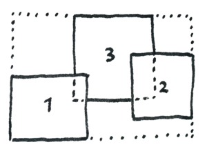
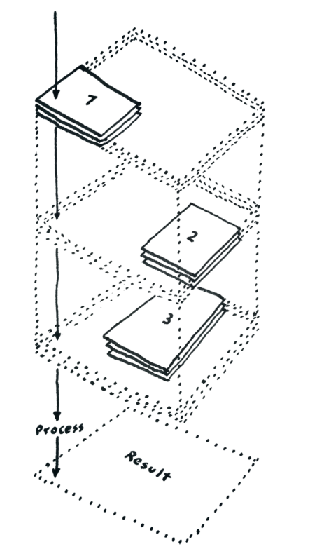
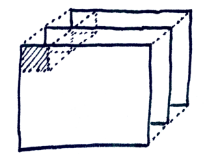

# StackComposed

StackComposed is a Qgis plugin processing that compute the stack composed (assemble and reduce) using a statistic to get the final value. The input stack layers is, for example a time series of georeferenced data (such as Landsat images) and they can be different scenes or have different extents to generate a mosaic. The result is an assembled image, with a  wrapper extent for all input data, with the pixel values resulting from the statistic for the specific band for all the valid pixels across the time axis (z-axis), in a parallel process.

The main aim of this app are:

- Improve the velocity of compute the stack composed
- Compute several statistics in the stack composed easily.
- Compute a stack composed for data in different position/scenes using a wrapper extent.
- Include the overlapping areas for compute the statistics, e.g. two adjacent scenes with overlapping areas.
- Compute some statistics  that depends of time data order (such as last valid pixel, pearson correlation) using the filename for parse metadata (for now only for Landsat images)

## Process flow

The general process flow is:

- Read all input data (but not load the raster in memory)
- Calculate the wrapper extent for all input data
- Position each data in the wrapper extent (the app does not exactly do this, use a location for extract the chunk in the right position in wrapper, this is only for understand the process)
- Make the calculation of the statistic in parallel process by chunks
- Save result with the same projection with the wrapper extent

### Compute the wrapper extent

The wrapper extent is the minimum extent that cover all input images, in this example there are 3 scenes of the images with different position, the wrapper extent is shown in dotted line:

The wrapper extent is the size for the result.

### Data cube process

With the wrapper extent then the images are located in a right position in it and put all images in a stack for process, the images are ordered across the time like a cube or a 3D matrix. When compute a statistic, it processes all pixel for the wrapper extent, first extract all pixel values in all images in their corresponding position across the z-axis, for some images this position don't have data, then it returns a NaN value that is not included for the statistic.

### Parallelization

There are mainly two problems for serial process (no parallel):

- When are several images (million of pixels) required a lot of time for the process
- For load several images (data cube) for process required a lot of ram memory for do it

For solved it, the StackComposed divide the data cube in equal chunks, each chunk are processes in parallel depends of the number of process assigned. When one chunk is being process, it loads only the chunk part for all images and not load the entire image for do it, with this the StackComposed only required a ram memory enough only for the sizes and the number of chunks that are currently being processed in parallel.

### Recommendation for input data

There are some recommendation for input data for process it, all input images need:

- To be in the same projection
- Have the same pixel size
- Have pixel registration

For the moment, the image formats support are: `tif`, `img` and `ENVI` (hdr)

### Statistics

Statistics for compute the composed along the "time" axis ignoring any nans, this is, compute the statistic along the time series by pixel.
- `median`: compute the median
- `mean`: compute the arithmetic mean
- `gmean`: compute the geometric mean, that is the n-th root of (x1 * x2 * ... * xn)
- `max`: compute the maximum value
- `min`: compute the minimum value
- `std`: compute the standard deviation
- `valid_pixels`: compute the count of valid pixels
- `last_pixel`: return the last _valid_ pixel base on the date of the raster image, required filename as metadata [(extra metadata)](#filename-as-metadata)
- `jday_last_pixel`: return the julian day of the _last valid pixel_ base on the date of the raster image, required filename as metadata [(extra metadata)](#filename-as-metadata)
- `jday_median`: return the julian day of the median value base on the date of the raster image, required filename as metadata [(extra metadata)](#filename-as-metadata)
- `trim_mean_LL_UL`: compute the truncated mean, first clean the time pixels series below to percentile LL (lower limit) and above the percentile UL (upper limit) then compute the mean, e.g. trim_mean_25_80. This statistic is not good for few time series data
- `linear_trend`: compute the linear trend (slope of the line) using least-squares method of the valid pixels time series ordered by the date of images. The output by default is multiply by 1000 in signed integer. required filename as metadata [(extra metadata)](#filename-as-metadata)

#### Chunks sizes

Choosing good values for chunks can strongly impact performance. StackComposed only required a ram memory enough only for the sizes and the number of chunks that are currently being processed in parallel, therefore the chunks sizes going together with the number of process. Here are some general guidelines. The strongest guide is memory:

- The size of your blocks should fit in memory.

- Actually, several blocks should fit in memory at once, assuming you want multi-core

- The size of the blocks should be large enough to hide scheduling overhead, which is a couple of milliseconds per task

#### Filename as metadata

Some statistics or arguments required extra information for each image to process. The StackComposed acquires this extra metadata using parsing of the filename. Currently support two format:

- **Official Landsat filenames:**
    - Example:
        - LE70080532002152EDC00...tif
        - LC08_L1TP_007059_20161115...tif

- **SMByC format:**
    - Example:
        - Landsat_8_53_020601_7ETM...tif

For them extract: landsat version, sensor, path, row, date and julian day.

## About us

StackComposed was developing, designed and implemented by the Group of Forest and Carbon Monitoring System (SMByC), operated by the Institute of Hydrology, Meteorology and Environmental Studies (IDEAM) - Colombia.

Author and developer: *Xavier Corredor Ll.*  
Theoretical support, tester and product verification: SMByC-PDI group

### Contact

Xavier Corredor Ll.: *xcorredorl (a) ideam.gov.co*  
SMByC: *smbyc (a) ideam.gov.co*

## License

StackComposed is a free/libre software and is licensed under the GNU General Public License.
